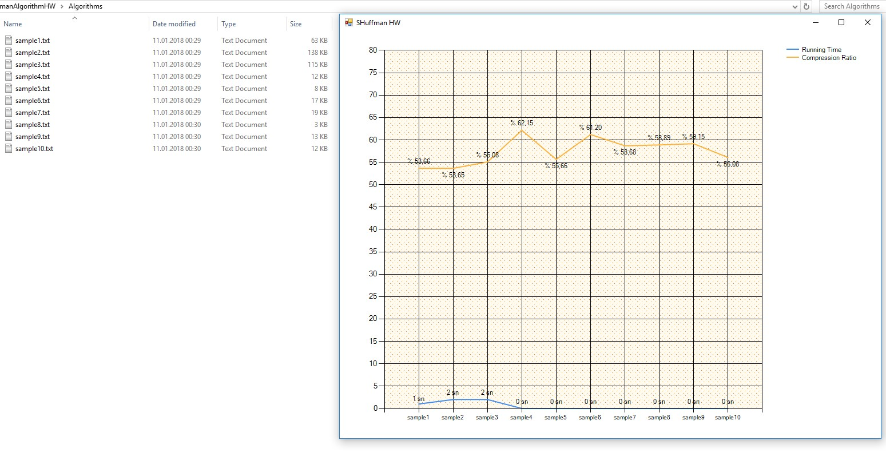

# Huffman Algorithm Homework
<strong>Huffman Coding ile dosya sıkıştırma</strong>

Bu uygulamada C# programlama dili kullanılarak static huffman coding algoritması ile
girdi olarak alınan metin dosyaları üzerinde yapılan işlemlerin çalışma zamanı(running time)
ve sıkıştırma oranı(compression ratio) bulunarak grafik üzerinde gösterilmiştir.

